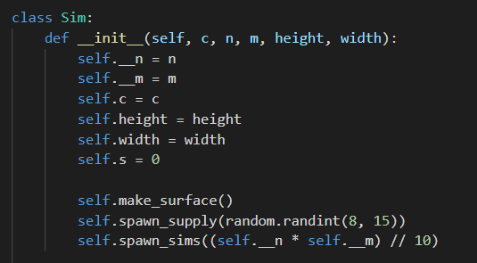

# Surviving

"Surviving" is a simulation game modified version of Conway's Game of Life.

main rule: 
1. If there is supply non-live cell becomes a live if he has at least 1 neighbor and dies if there more than 4 heighbors
2. In case when there is no supply cell dies and becomes a live according Game of lives rule: "Any live cell with two or three live neighbours survives. Any dead cell with three live neighbours becomes a live cell. All other live cells die in the next generation. Similarly, all other dead cells stay dead."
3. After each 30 steps "supplies" are re-spawning

## Code review

Main class is Sim, it takes 5 arguments:
- c - Canva
- 2 args for matrix size (n and m arguments)
- Also height and width arguments to draw

### mehtods:
"make_surface" methods creates matrix n by m as self.surface

"spawn_sims" this method fills self.surface randomly "n" amount of live cell

"spawn_supply" is the same as "spawn_sims", but here randomly fills "n" amount of supplies 

"step" makes step according rules. Firs it checks if he should refresh supplies and then makes step

"draw" this main methods which pictures "beatiful surface"
